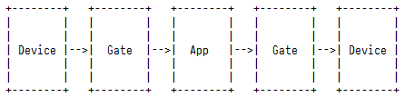

# RsspGate
---------------------------------------------
**功能：**
进行协议转换与转发

**配置**
配置`config.json`包括3部分：分别定义设备，端口和路由方式。
1. 端口`gates`
RsspGate开启的端口，可与设备进行通信。
* `name`：开启端口名称（**必选项**）
* `ip`：端口绑定IP地址（可省略，省略后对本机所有地址监听）
* `port`：监听端口
* `type`：端口类型（UDP，TCP(*TODO*)）

2. 设备`devices`
一个远端端口被定义为一个设备。
`name`： 设备名称（**必选项**）
`ip`： 设备IP地址（可省略，缺省值为127.0.0.1）
`port`：设备端口号（**必选项**）

**TODO**
* []增加设置条件功能
* []增加翻转reverse操作功能
* [tcp]增加TCP端口实现
